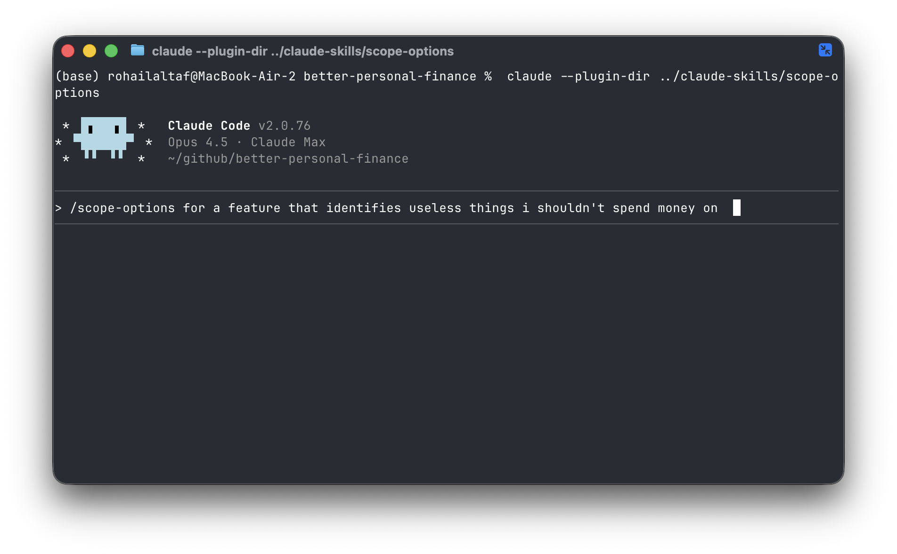
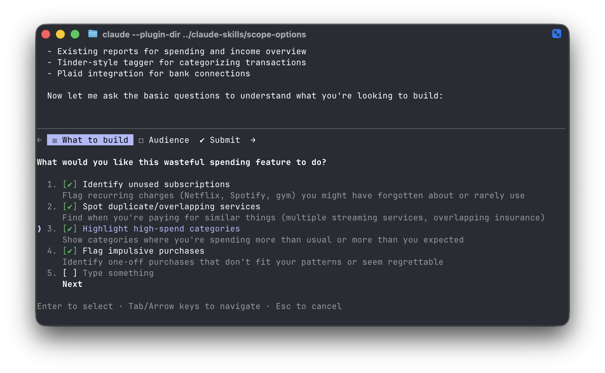
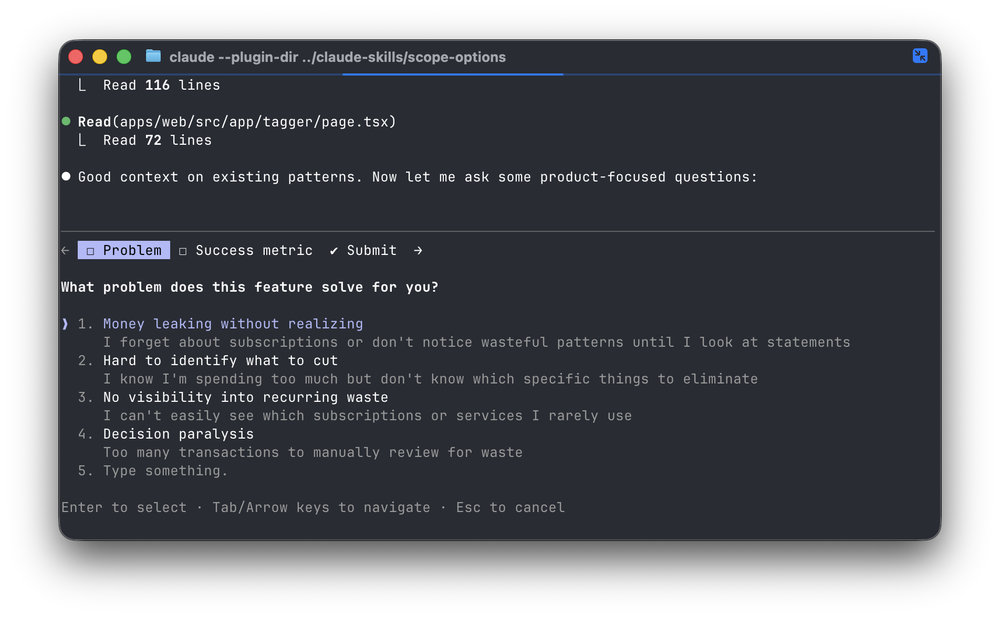
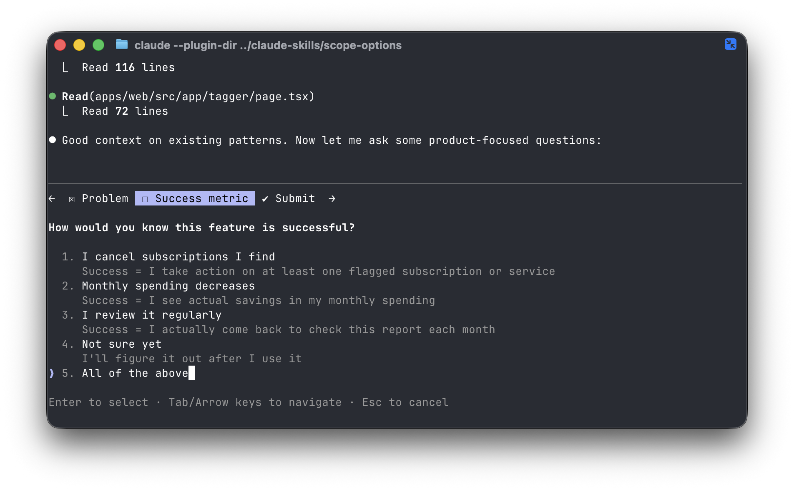
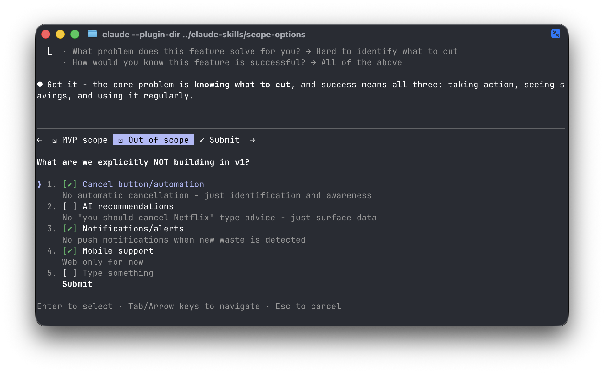
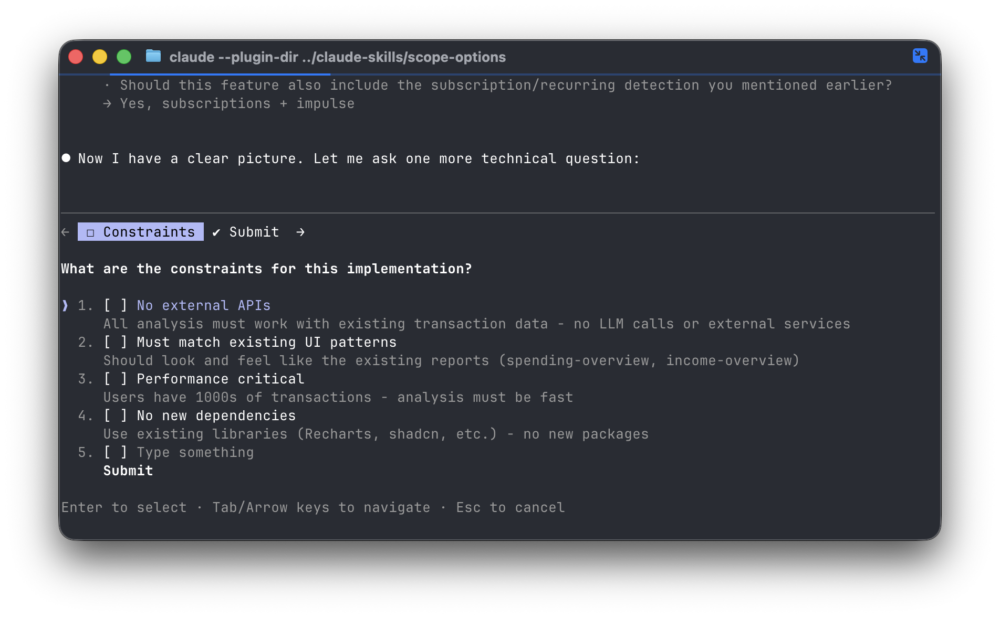
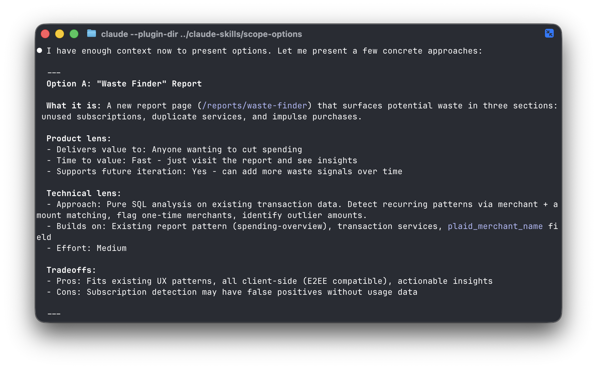
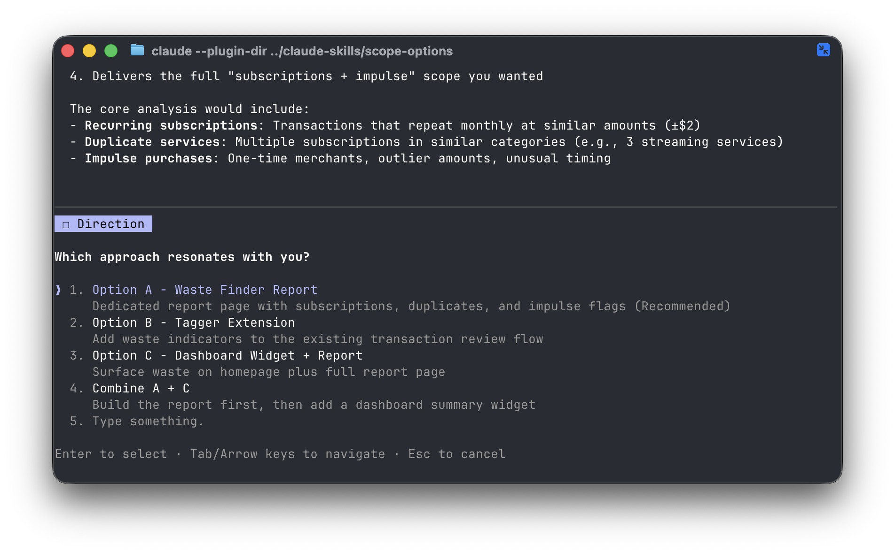
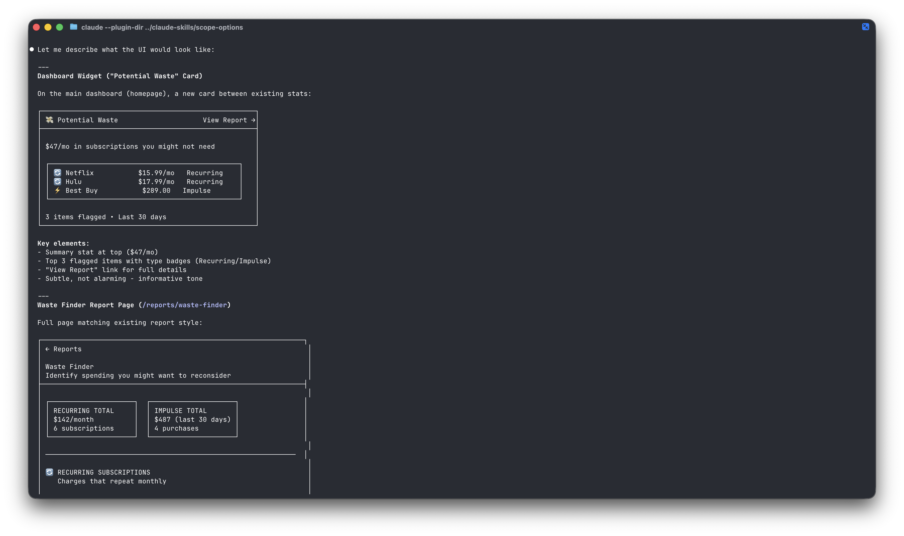

# Claude Skills

A collection of custom skills for Claude Code.

## Table of Contents

- [update-docs](#update-docs) - Update documentation after completing work
- [scope-options](#scope-options) - Plan mode on steroids

## update-docs

Updates markdown documentation files after completing work. Invoke with `/update-docs` or by asking Claude to update the docs.

The skill will:
- Ask what to review (uncommitted, committed, both, or whole repo)
- Find existing documentation files in your repository
- Update relevant sections based on changes or audit entire docs against codebase

### How it works

1. Invoke the skill with `/update-docs`


2. Select what changes to review


3. Claude searches for documentation files and reviews recent changes


4. Claude proposes updates to your documentation


### Installation

```
/plugin marketplace add rohailaltaf/claude-skills
/plugin install update-docs@rohailaltaf-skills
```

## scope-options

Plan mode on steroids. Invoke with `/scope-options` before building a feature.

The skill will:
- Ask structured questions (product first, then technical)
- Push you to define: who benefits, what success looks like, what's MVP, what you're NOT building
- Deep dive into your codebase to inform options
- Present 2-5 concrete options with product AND technical tradeoffs
- Help you narrow down to a direction

Forces engineers to think with a product mindset before writing code.

### How it works

1. Invoke with `/scope-options` and describe what you want to build



2. Select what you want the feature to do



3. Define what problem it solves



4. Define how you'll know it's successful



5. Explicitly define what's out of scope



6. Answer technical constraint questions



7. Review concrete options with product and technical tradeoffs



8. Select which approach resonates



9. Get ASCII UI mockups for your chosen approach



### Installation

```
/plugin marketplace add rohailaltaf/claude-skills
/plugin install scope-options@rohailaltaf-skills
```
