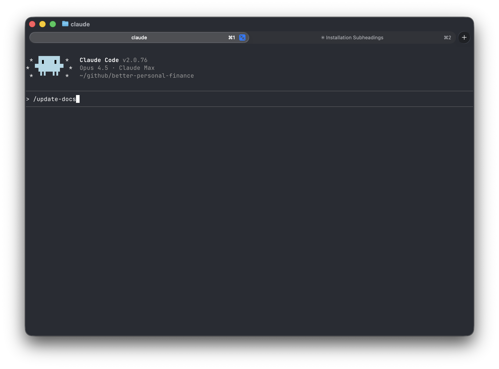
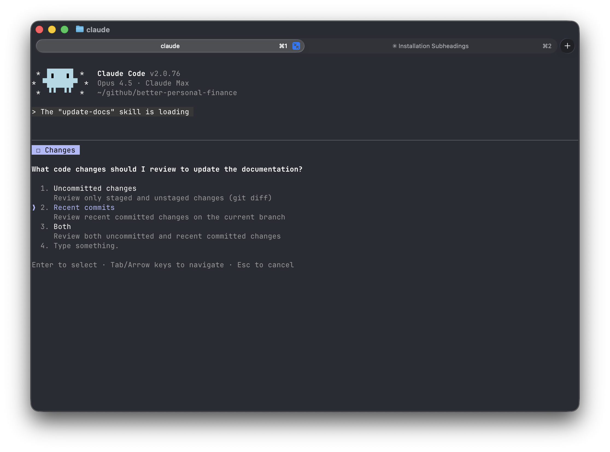
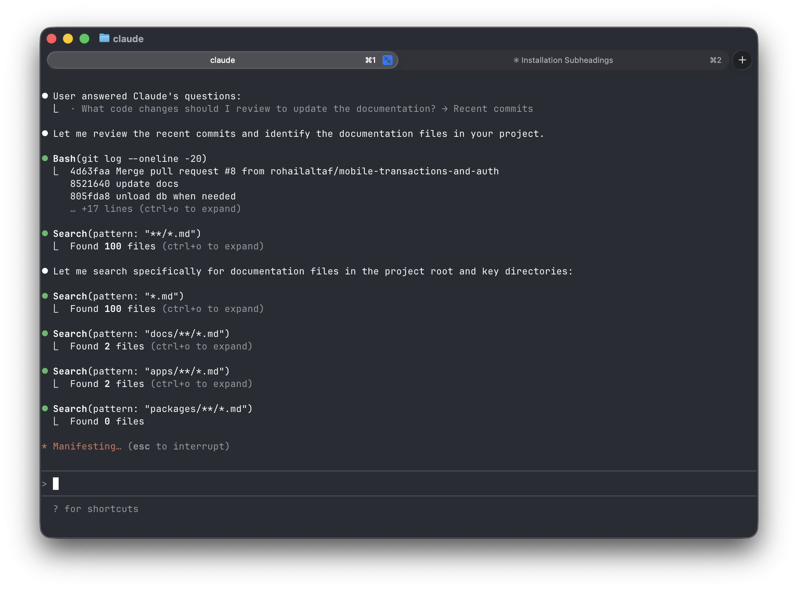

# Claude Skills

A collection of custom skills for Claude Code.

## update-docs

Updates markdown documentation files after completing work. Invoke with `/update-docs` or by asking Claude to update the docs.

The skill will:
- Ask what to review (uncommitted, committed, both, or whole repo)
- Find existing documentation files in your repository
- Update relevant sections based on changes or audit entire docs against codebase

### How it works

1. Invoke the skill with `/update-docs`



2. Select what changes to review



3. Claude searches for documentation files and reviews recent changes



4. Claude proposes updates to your documentation


### Installation

```
/plugin marketplace add rohailaltaf/claude-skills
/plugin install update-docs@rohailaltaf-skills
```
